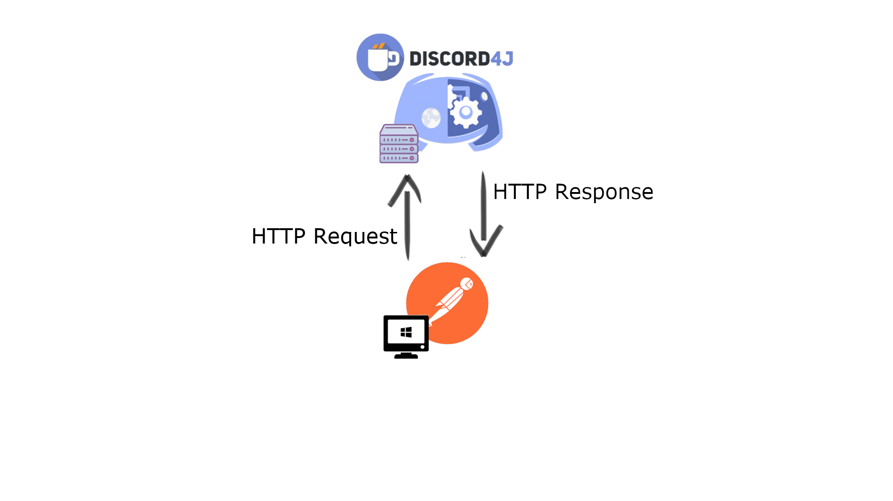
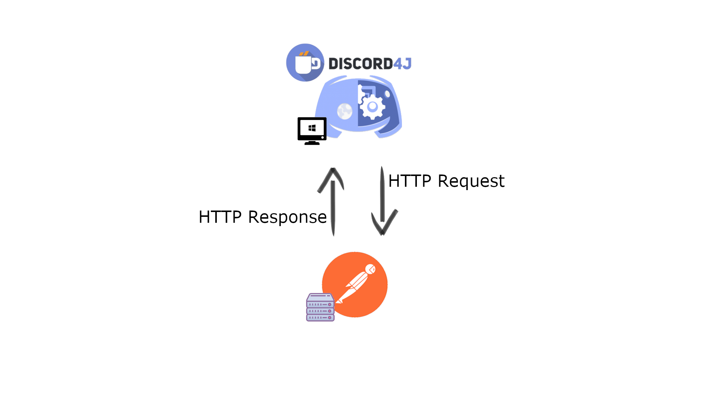
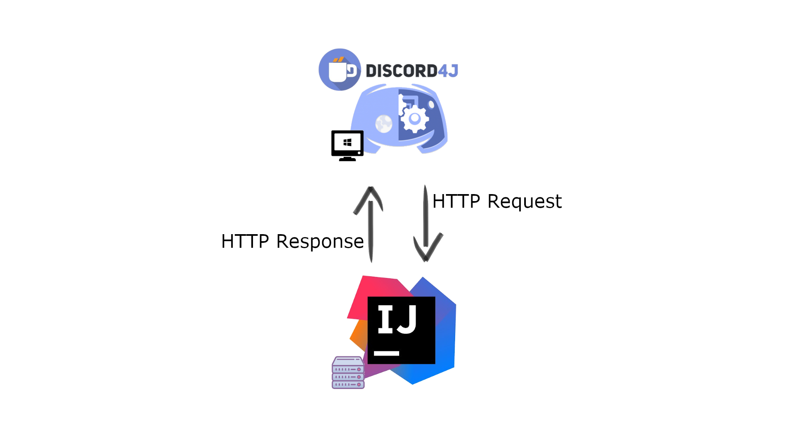
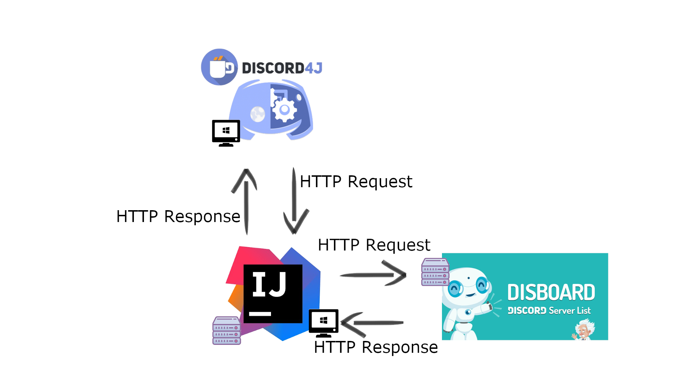

# debateBump
Work on a bot that bumps threads to advertise abortion debate Discord. We want to increase our rate of new users.

# Preparation

I don't know much about creating a Discord bot, which communities to advertise to, or much about Discord and/or web interfaces/APIs. 

## Feasibility 

We do not want to create an awesome bot that is ultimately blocked by rules or regulations. Because I care about ethics, I am not willing to create something through unethical means like something against terms of service (TOS) or hacking other people to create a botnet.   

### Known information before investigation
* There are already bump services out there (such as Open Bump).
* APIs are blessed by the application owners themselves
* We have control over our own accounts and computers. 

### New information

> Automating normal user accounts (generally called "self-bots") outside of the OAuth2/bot API is forbidden, and can result in an account termination if found.

This means we must use the Discord allowed bot accounts. Can discord bot accounts interact with websites? As long as discord channel finding websites are not partnered with Discord, we should be able to interact with them outside of the official Discord rules. Does this mean we create a bot inside or outside of Discord? If we create the bot inside Discord, we can use Discord as an interface. 

### Conclusive decision

Create a bot through Discord. At the very least, we will learn how to develop bots for Discord. If we are not able to interact through HTTP protocol, then we just switch to something else outside of Discord. However, on first glance, it looks like at least RESTful protocol is available [(Discord bot dev page)](https://discordapp.com/developers/docs/intro)

## Possible Communities

* Disboard 
* Discord Me

## Overall Plan
After reading about the possibilities for a Discord Bot, I came up with an initial plan. It could be possible that all the functionality can be written inside the Discord Bot, but I want to only start out using the Discord Bot merely as an interface to the code application. The Discord Bot will essentially take human readable API commands, talk to the app via an HTTP request, and then the app will interact with the Discord Community Website in any way it needs to via API or a DOM reader library. 

We should use other libraries as much as we can. When possible, it is better and more efficient to simply import a library rather than making the code from scratch. I am choosing to write in Java because I want to learn more about Java OOP. 

First we will set up the Discord Bot, create an API, and then ping it from the Postman software app which allows us to quickly use REST API request types or set up a mock server to ping requests against from outside applications. 

The Discord Bot will then be the one pinging the mock server on Postman. This is how it will actually be. The Discord user will send a command like "!bump" and then the bot will send a request to the application to execute the code. 

The Postman lightweight software will be replaced with an IntelliJ application. 

We will then provide actual functionality to run that interacts with the Discord Community Server Finder. 

# MVP 1.00

The initial minimum viable product is to create a bot that can be used by the moderation team in abortion debate that does something on a discord channel finding website. The initial website interface action needs to be something innocuous like commenting on my personal profile. I am trying to not get IP banned and also trying not to be disruptive due to a bug. For example, I don't want the bot to spam our discord channel over and over again because I forgot to exit a while loop. 

## First goal: Create a Discord Bot

I must first create a discord bot that interacts within discord. The goal is to create a discord bot, add it to my discord, give it a bot role, and then make it count to ten using a "!count" command. 